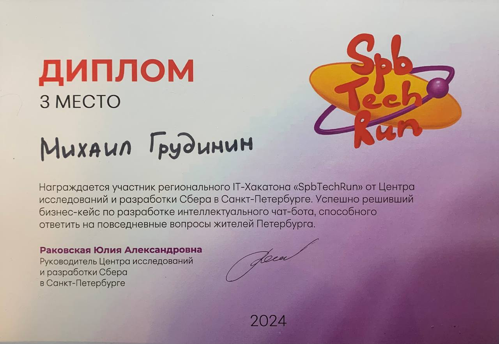
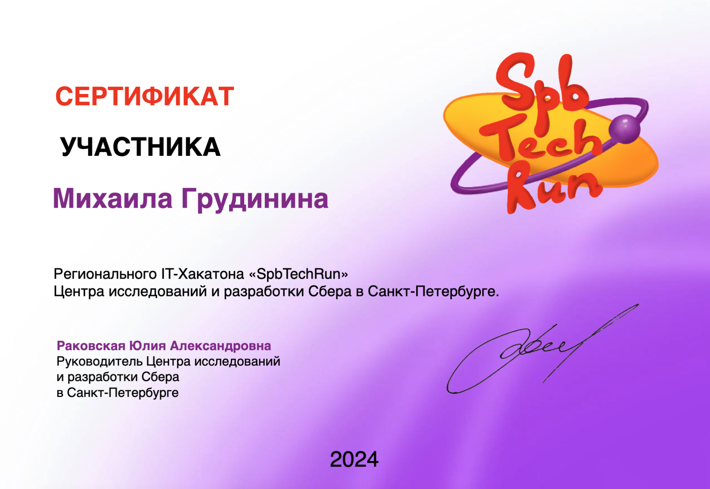

# Кейс Интеллектуальный чат-бот «Я здесь живу»

Интеллектуальный чат-бот "Я Здесь Живу" (ЯЗЖ) на основе технологии Large Language Model (LLM), способный отвечать на разнообразные вопросы жителей о повседневной жизни в Санкт-Петербурге и его районах. AI-помощник должен использовать открытые данные Санкт-Петербурга в качестве основы своей базы знаний, обрабатывая и интерпретируя эту информацию для предоставления актуальных и точных ответов на запросы пользователей, что сделает его полезным инструментом в повседневной жизни горожан и гостей города.

# Образ результата
Разработать интеллектуальный чат-бот "Я Здесь Живу" (ЯЗЖ) на основе технологии Large Language Model (LLM) с применением подхода Retrieval-Augmented Generation (RAG).
Использование LLM для генерации ответов.
Реализация RAG для эффективного поиска и использования релевантной информации из базы знаний.
Интеграция с API открытых данных Санкт-Петербурга для получения актуальной информации в реальном времени.
Реализация системы логирования и анализа запросов для дальнейшего улучшения работы бота. Внедрение принципов обеспечения этичного и безопасного взаимодействия с пользователями

## Данные

[База Контактов Санкт-Петербурга](data/contacts.xlsx) 

[База знаний Санкт-Петербурга](https://gu.spb.ru/knowledge-base/)

[Цифровой Петербург (API открытых данных)](https://petersburg.ru/) 
(примеры запросов описаны в папке notebook)

[Дополнительный список типовых вопросов](data/questions.xlsx)

[Дополнительный источник данных - поисковик](https://www.gov.spb.ru/)

## Сценарии (Agent Tools), расположены по приоритету наличия в решении

1. Благоустройство, ЖКХ и уборка дорог
2. Поиск контактов, основанный на Базе Контактов Санкт-Петербурга
3. Поиск релевантной информации, ответ на вопрос основанный на Базе Знаний Санкт-Петербурга
4. Образование, Детские сады и Школы
5. Раздельный сбор 
6. Афиша + Красивые места
7. Поисковик на сайте https://www.gov.spb.ru/

## Критерии оценки итогового решения

1. Соответствие решения поставленной задаче (Оценка от 0 до 10)
2. Оригинальность - использование нестандартных технических и проектных подходов к решению задачи (Оценка от 0 до 5)
3. Работоспособность решения и его технологическая сложность (Оценка от 0 до 5)
4. Аргументация выбранного способа решения (Оценка от 0 до 5)
5. Качество предоставления информации и наличие удобного UX/UI (Оценка от 0 до 5)

## Технические критерии оценки итогового решения

1. Использование как минимум трех сценариев
2. Возможность тестирования и демонстрации работы решения (Консоль, LangSmith, API)
3. Время ответа до 5 минут
4. Контекст диалога с пользователем должен запоминаться и учитываться при ответах

